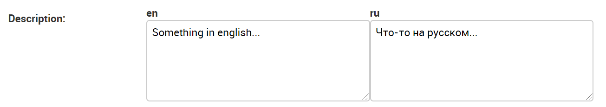

# Installation

To add this field tou your project follow next steps:

1. clone this code using
` git clone https://github.com/Alick09/django-multilanguage-text.git`

2. copy everything from `src/templates` to your templates folder

3. copy `src/fields` folder to `utils` (or anywhere else)

4. add next string to your **settings.py** file:
    ```
    FORM_RENDERER = 'django.forms.renderers.TemplatesSetting'
    ```
    It will allow your django-project to search form templates in usual template folder
    
5. You will also need to update your TEMPLATES setting so that Django can still use the built in widget templates. 
The easiest way to do this is to add `django.forms` to **INSTALLED_APPS**.


# Usage

- To change default languages just edit file `fields/multilanguage_text/model.py`.
    ```
    DEFAULT_ORDER = ['en', 'ru']
    ```

- To add multilanguage text to your model just use MultilanguageTextField from `fields.multilanguage_text`. 
I have created next example to understand better.

    ```
    from utils.fields.multilanguage_text import MultilanguageTextField

    class Project(models.Model):
        title = models.CharField(max_length=256, null=False)
        description = MultilanguageTextField(editable=True, null=True)  # <---- Here is the actual use
    ```

- In admin page this type of field will automaticaly look great:
    <kbd></kbd>

- If you are using Django's `i18n` module for internationalization you can use this field in templates like this:

    ```
       {{project.description.get}}
    ```


# Epilogue

* This project has been created because I haven't found normal documentation about such things. 
You can use this code if you want to implement any other custom ModelField with specific Widget.

* You also can help to people making contribution. You can fork it or make pull requests. Or just star it if you think that it can be useful.

